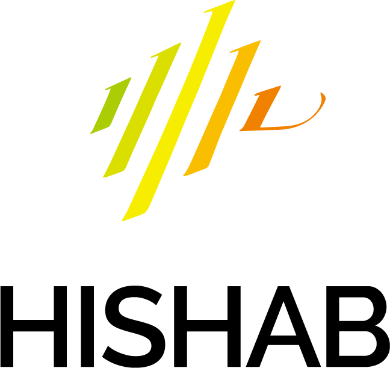

<!--## Welcome!-->
The first Bangla Language Processing (BLP) Workshop will be co-located with EMNLP on 7th December, 2023 in Singapore. More information will be announced soon.

<!--
## News
- May 12 First call for paper!
- May 12 Website is up!
 
 
 
 
 
 

<!--## About BLP -- 2023-->
<!---->
Bangla– a member of the Indo-Aryan language family, is ranked as the 6th most widely spoken language across the world, with 230 million native speakers from Bangladesh and India1. This morphologically rich language has a long-standing literacy tradition, with diverse dialects and language dependent challenges. Bangla, with three decade of research history is still considered a low-resource language in the natural language processing (NLP) and speech community [Alam et al., 2021a](https://arxiv.org/pdf/2107.03844.pdf), mainly due to the limited and scattered research efforts by individual researchers. These line of sparse works are not highly visible to the international research community.

Therefore, this workshop aims to provide a forum for researchers to share and discuss their ongoing work with the international community. Following the success of prior local editions of the conferences in <a href="https://ieeexplore.ieee.org/xpl/conhome/8537873/proceeding" target="_blank">2018</a> and <a href="https://ieeexplore.ieee.org/xpl/conhome/9081812/proceeding" target="_blank">2019</a>, in this first edition of the workshop, we will focus on Bangla, which is a low-resource language, and assess its current state-of-the-art and discuss strategies to make further progress in both NLP, Speech and multimodal research. Through this workshop, we plan to bring researchers together to come up with frameworks and strategies that can later support to other low-resource languages. This workshop is timely given the continued rise in research projects focusing on low-resource and multilingual studies. We particularly encourage researchers to submit their papers focusing on novel methodologies and resources that help towards the progress of Bangla and other low-resource languages. Novel methodologies include, but are not limited to, zero-shot learning, unsupervised learning, and simple yet effective methods applicable to low-computation scenarios.

## **Supported by**
-------------
[**EBLICT**](https://bangla.gov.bd/)
 

 

[**Bangladesh Open Source Network (BdOSN)**](https://www.bdosn.org/)

    

## **Sponsors** -    
We are looking for sponsors. If you are interested please check [call for sponsors](sponsors)
### Gold
[**CloudCamp Bangladesh**](https://cloudcampbd.org/)
 

### Bronze
<!--  -->
[**Hishab**](https://hishab.co/)
 

[**BlackBird**](https://blackbird.ai/)
 

[**KANARI AI**](https://kanari.ai/)
 

[**Amazon**](https://www.amazon.science/)
 

<!-- ## References
* Firoj Alam, Arid Hasan, Tanvirul Alam, Akib Khan, Janntatul Tajrin, Naira Khan, and Shammur Absar Chowdhury. 2021a. [A review of bangla natural language processing tasks and the utility of transformer models](https://arxiv.org/pdf/2107.03844.pdf). arXiv preprint arXiv:2107.03844. -->

## **Anti-Harassment Policy**
-------------
EMNLP adheres to the [ACL Anti-Harassment Policy](https://www.aclweb.org/adminwiki/index.php?title=Anti-Harassment_Policy). Any participant who experiences harassment or hostile behaviour may contact any current member of the [ACL Professional Conduct Committee](https://www.aclweb.org/adminwiki/index.php/Professional_Conduct_Committee). Please be assured that if you approach us, your concerns will be kept in strict confidence, and we will consult with you on any actions taken.
