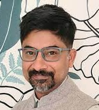

## Keynote
**Title: Data'r Panchali: The Changing Landscape of Bangla NLP**

**Abstract:**
Over the past three decades, Natural Language Processing technologies in Bangla have made remarkable progress. The advent of generative AI has accelerated this journey, leading to impressive breakthroughs across multiple domains. Yet, two profound questions persist. First, what tangible benefits do these advances bring to Bangla speakers? Who stands to gain and who remains excluded? Second, has the technological gap between English (and other high-resource languages) and Bangla truly narrowed, or has it quietly widened?

Ultimately, both the triumphs and the shortcomings of Bangla NLP trace back to one fundamental factor: the availability and absence of data. In this talk, I will explore these questions through both empirical analysis and personal reflection, examining how data shapes access, equity, and innovation. I will conclude with a discussion of some intriguing possibilities: how generative AI might illuminate deeper questions about culture, linguistic diversity, and the evolving identity of Bangla itself.

**Speaker:** [Monojit Choudhury](https://mbzuai.ac.ae/study/faculty/monojit-choudhury/), Professor, Mohamed bin Zayed University of Artificial Intelligence (MBZUAI), UAE.

 
 

**Bio:** [Monojit Choudhury](https://mbzuai.ac.ae/study/faculty/monojit-choudhury/) is a Professor of Natural Language Processing at the Mohamed bin Zayed University of Artificial Intelligence (MBZUAI) in Abu Dhabi. His research sits at the intersection of language technology and society, with a particular focus on how foundation models learn and (mis)represent linguistic and cultural diversity, and how to design fair, inclusive language technologies for low-resource and marginalized languages. Prior to joining MBZUAI, he was a principal researcher at Microsoft Research India from 2009 to 2022 and a principal applied scientist at Microsoft Turing (part of Microsoft India Development Center) from 2022 to 2023. He also serves as adjunct faculty at the International Institute of Information Technology, Hyderabad (since 2017). Professor Choudhury is the general chair of the Panini Linguistics Olympiad (India’s national linguistics Olympiad) and founding co-chair of the Asia Pacific Linguistics Olympiad. He is deeply committed to popularizing linguistics and natural language processing among schoolchildren and non-experts, often through carefully designed puzzles and problem-solving activities.

## Workshop Schedule

TBA
