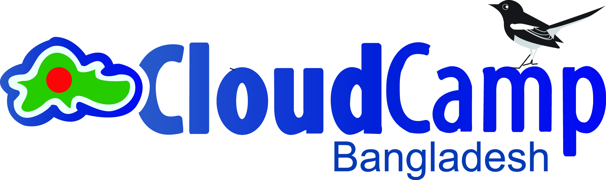
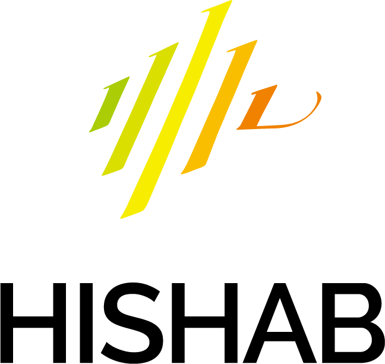

## Call for Sponsors
The first Bangla Language Processing (BLP) 2023 offers a unique opportunity for companies and institutions to closely interact with the scholars in the academia and industry, and the postgraduate students in the field. You may contact the Sponsorship Chairs: Dr. Shammur Absar Chowdhury (email: shchowdhury@hbku.edu.qa), Dr. Ruhul Amin Shajib (email: shajib.sust@gmail.com) for [sponsorship packages](assets/Sponsorship_Brochure-BLP2023.pdf).

Your organization may contact us at your earliest convenience. To better facilitate your request concerning sponsorship packages, you are encouraged to submit your application as early as possible and by October 15, 2023 in all cases.

### Supported by
[**EBLICT**](https://bangla.gov.bd/)
 

 

<!-- ## Sponsors -->
### Diamond
[**CloudCamp Bangladesh**](https://cloudcampbd.org/)
 

### Platinum
To be announced

### Gold
To be announced

### Silver
To be announced

### Bronze
<!--  -->
[**Hishab**](https://hishab.co/)
 

